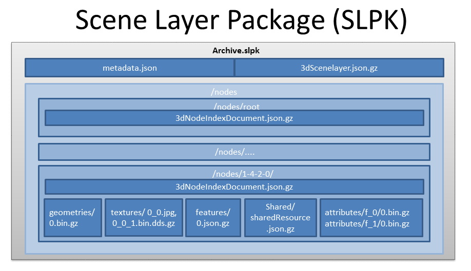

== Persistence

I3S scene layers can be delivered to web, mobile and desktop clients using a number of different patterns. Most users will interact with scene layers using applications that access cloud or server based information via RESTful interfaces/services. In these cases the cache (the I3S nodes and their payloads) for the scene layer resides on the server and is returned to clients via a RESTful interface that exposes the scene layer, its nodes and their associated resources (geometries, attributes, textures) as web addressable resources.

The I3S standard contains a complete description of the web addressable resources and their URL scheme.

Alternatively, a scene layer can be delivered as a Scene Layer Package. – This is a single file that packages the complete node tree and its resources into an archive that supports direct access to the individual nodes and resources within it. Scene Layer Packages (SLPK files) are part of the current I3S implementation with multiple generators and the ability by clients to consume packages containing hundreds of Giga-Bytes of content.

All storage methods store the Indexed 3D Scene Layers in a simple key-value structure, with the key representing the access URL and the value being the JSON document or other resource type.

==== 11.1	Scene Layer Packages 
Scene Layer Packages (SLPK) allow a complete I3S layer, with all resources, to be transported or exchanged as a single file. A SLPK package can be consumed by applications directly.

The format of the package itself is defined as follows:

-	The Archive type is always Zip64 .
--	On this Archive, an overall compression scheme may be applied. This compression scheme SHALL be either STORE or DEFLATE64. Standard DEFLATE is acceptable as a fallback if DEFLATE64 is not available, but will only work with smaller SLPKs. 
--	STORE is the preferred compression schema for an SLPK intended for direct consumption by client application, especially if a resource compression is already applied on the individual resources (as shown in the figure 15 below).
-	Every resource except textures may also be individually compressed. Compressed textures (such as S3TC) can additionally have GZIP  compression applied to them. 
-	For resource compression, only the GZIP scheme is supported, as DEFLATE support is not universally available supported in all browsers.

The layout shown in Figure 15 below is referred to as the BASIC folder pattern. The I3S standard allows also for an EXTENDED folder pattern that uses subtree partitions to avoid problems with very large packages. The top level includes a nodes folder with
-	A subfolder that contains all node resources
-	A metadata.json file that describes the content of the SLPK
-	A 3dSceneLayer.json.gz file that defines the Scene Layer

[#fig_slpk,reftext='{figure-caption} {counter:figure-num}']
.Example of a SLPK with BASIC folder layout

The 3dNodeIndexDocument.json.gz, features/0.json.gz and SharedResource.json.gz correspond to 3dNodeIndexDocument, 
featureData and SharedResource documents of the Scene Layer, and are JSON with GZIP compression.

An SLPK with basic folder layout has at the top level a nodes subfolder containing all node resources, a metadata.json 
file that describes the content of the SLPK and a 3dSceneLayer.json.gz file that defines the Scene Layer. In the example 
above, the nodes subfolder contains, nodes named root, 1-4-2-0, and other nodes not pictured. All file resources within 
a particular node (e.g. 1-4-2-0), can be individually compressed with GZIP (indicated by the file extension .gz). Note, 
the texture resource is not compressed because it is an image (JPEG textures/0_0.jpg).

Resources in subfolders, like geometries and attributes, are serialized as binary, and correspond to the geometryData 
and attributeData (e.g. geometries/0.bin.gz and attributes/f_0/bin.gz).

For the above mentioned two use cases, an SLPK file is employed as follows:

.	SLPK as a transfer format: 
..	ArchiveCompressionType: DEFLATE64
..	ResourceCompressionType: NONE
.	SLPK as a serving format: 
..	ArchiveCompressionType: STORE
..	ResourceCompressionType: GZIP

==== 11.1.1	Metadata
Every SLPK archive has a metadata.json file. The following entries are required and must be of the specified type. The 
default is in *bold*.

[width="90%",options="header"]
|===
|*Property*	|*Required*	|*Notes*
|folderPattern	|True	|One of {*BASIC*, EXTENDED}
|ArchiveCompressionType	|True	|One of {*STORE*, DEFLATE64[,DEFLATE]}
|ResourceCompressionType	|True	|One of {NONE, *GZIP*}
|I3SVersion	|True	One of |{1.2, 1.3, 1.4, 1.6}
|nodeCount	|True	|Total number of nodes stored in this SLPK.
|===

=== 11.2	Key Value Stores
In this persistence schema, all scene layer resources are stored within either key value based cloud blob stores such as Windows Azure Blob Storage or Amazon Simple Storage (S3) or within more general key value stores. In the case of cloud blob stores, layer resources are stored as either simple objects within containing buckets (S3) or blobs within blob containers (Azure). In all cases each resource within a scene layer is identified by a unique key. The default is in *bold*.

[#table_slpk,reftext='{table-caption} {counter:table-num}']
.Example showing the layout of a SceneService.
[width="90%",options="header"]
|===
|I3S |Resources	|Required	|Notes
|/SceneServer	|Yes	|The _SceneServiceInfo_ JSON that defines the service name and list the layers offered by this Scene Service. +
Content type: text/plain, +
Content encoding {NONE, *GZIP*}
|/SceneServer/layers/0	|Yes	|The 3dSceneLayer JSON resource. The layer id (e.g. 0) is used as the key of the document. +
Content type: text/plain +
Content encoding {NONE, *GZIP*}
|/SceneServer/layers/0/nodes/root	|Yes	|The 3dNodeIndexDocument of the layer as a JSON resource. The node id (e.g. root) is used as the key of the document. +
Content type: text/plain +
Content encoding: {NONE, *GZIP*}
|/SceneServer/layers/0/nodes/0	|Yes	|The 3dNodeIndexDocument of the layer as a JSON resource. The node id (e.g. 0) is used as the key of the document +
content type: text/plain, +
content encoding: {NONE, *GZIP*}
|/SceneServer/layers/0/nodes/0/shared	|Yes	|The SharedResource of the node as a JSON resource. The keyword shared is used as the key of the document. +
content type: text/plain, +
content encoding {NONE, *GZIP*}
|/SceneServer/layers/0/nodes/0/features/0	|No	|The FeatureData document of the node as a JSON resource. The resource array id (e.g.0) is used as the key of the document. +
content type: text/plain, +
content encoding: {NONE, *GZIP*}
|/SceneServer/layers/0/nodes/0/geometries/0	|Yes	|The GeometryData of the node as a binary resource. The resource array id (e.g.0) is used as the key of the resource. +
content type: application/octet-stream, +
content encoding {NONE, *GZIP*}
|/SceneServer/layers/0/nodes/0/textures/0_0	|No	|The Texture of the node as a binary resource. The resource id (e.g. 0_0) is used as the key of the resource. +
content type: image/jpeg, 
content encoding {*NONE*}
|/SceneServer/layers/0/nodes/0/textures/0_0_1	|No	|The compressed texture of the node as a binary resource. The resource id (e.g. 0_0_1) is used as the key of the resource. +
content type: image/vnd-ms.dds, 
content encoding {NONE, *GZIP*}
|/SceneServer/layers/0/nodes/0/attributes/f_0/0	|No	|The AttributeData as a binary resource. The resource id (e.g.0) is used as the key of the resource. +
Content type: application/octet-stream, +
Content encoding: {NONE, *GZIP*} 
|/SceneServer/layers/0/nodes/0/attributes/f_1/0	|No	|Same as the attributeData resource f_0/0 above.
|/SceneServer/layers/0/nodes/1-4-2-0	|Yes	|same as node resource root and 0.
|===

_Detail: A typical example showing the layout of a SceneService in a key value store environment. The example illustrates the structure of the service using a 3D Object scene layer containing textured geometries as well as attribute data._
