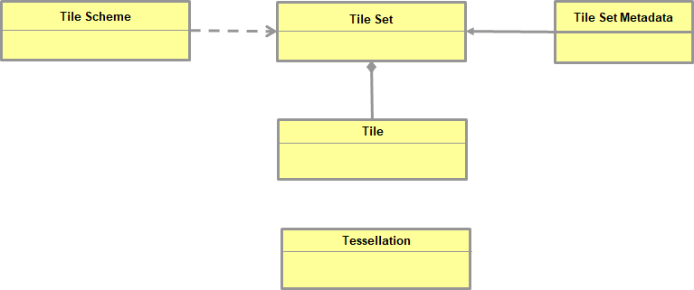

[[ConceptualModel]]

== Conceptual Model for tiling any space

This section describes a general tiling conceptual model. The next section defines a detailed logical model for tiling 2D Euclidean Space. The conceptual model is very abstract and cannot be implemented as is. One or more logical models are required to provide the requirements and structure necessary to move to implementation. Therefore, in addition to the conceptual model, this Abstract Specification also specifies a logical model for the 2-D planar (Euclidean) use case. 

NOTE: _The logical model could be in a separate Part 1 document. Up for discussion_

=== General Tile/Tiling Conceptual Model

The following figure captures the fundamental conceptual model for a space paritioning based on tiles. This conceptual model can be applied to any spatial data independent of any space/time dimension.

[#img_concept-model,reftext='{figure-caption} {counter:figure-num}']
.Conceptual for space partitioning based on tiles.

This figure captures the fundamental concepts for defining and implementing a tiled structure. Each of the concepts is briefly defined.

`*tile*`: The fundamental unit for partitioning space. A `tile` is a geometric shape with known properties that is the result of the tiling (tessellation) of the space defined by the tile schema. A tile consists of a single connected "piece" without "holes" or "lines" (topological disc). In two dimensional space, a tile could be regular (e.g. square) or irregular (e.g. Thiessen polygon). A voxel is an example of a regular partitioning of 3 dimensional space. Specific properties of a `tile`, such as width and height, are specified in a logical model

`*tile set*`: A set of tiles with common properties that meets the definition of the tile schema and tiled based on the tessellation rules. The common properties of a `tile set` are specified in the tile schema.

`*tile scheme*`: A scheme that defines a set of common properties that define the `tile set`. The schema could define the spatial reference system, the geometric properties of a tile, which space a uniquely identified tile occupies, and reversely which unique identifier corresponds to a space satisfying the geometric properties to be a tile. The actual properties required for some tiling approach that can be implemented are specified in a logical model. 

`*tessellation*`: In addition to the definition provided in the Terms and Definition, the `tessellation` concept includes the rules for tessellating space into a `tileset`. The specific allowed/required `tessellation` approaches are specified in the logical model.

`*tile set metadata*`: In addition to the common properties that define a tile set additional metadata may be provided. Such metadata could be an abstract, the owner, the author, or other common metadata. The logical model specifies which metadata elements may be required.
