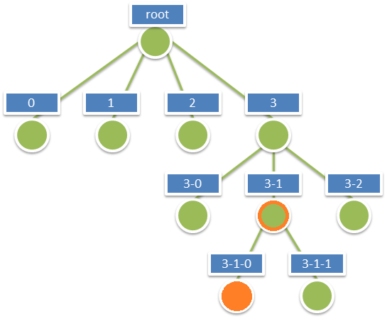
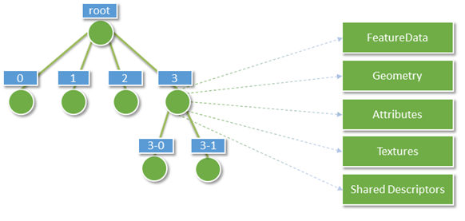
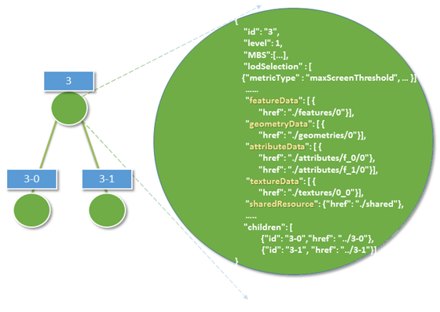
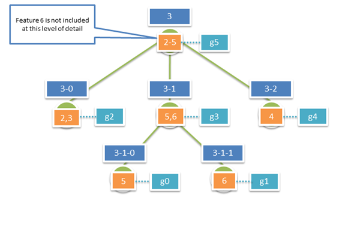
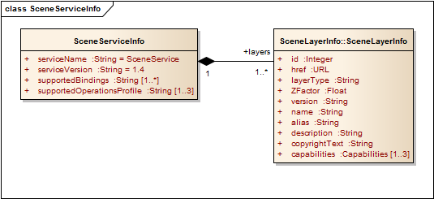

== I3S Specification - Normative

This section contains the normative clauses and requirements for implementing I3S. In the property tables, any property highlighted with a bold font is mandatory.

=== Coordinate Reference Systems

The I3S standard supports specifying the Coordinate Reference System and refers to two OGC standards for describing a CRS as Well Known Text. These are WKT1 as defined in the OGC Coordinate Transformation Service Standard (01-009) and WKT2 as defined in OGC Geographic Information – Well known text representation of coordinate reference systems (12-063r5). CRS as OGC Well Known Text was originally defined in clause 6.4 in the http://portal.opengeospatial.org/files/?artifact_id=13227[OGC Simple Features 99-036/ISO 19125] standard. 

I3S also supports specifying CRS in the ISO/OGC WKT standard http://docs.opengeospatial.org/is/12-063r5/12-063r5.html[ISO 19162:2015], Geographic information – Well-known text representation of coordinate reference systems. This new ISO/OGC Standard specifies an update to the original WKT representation. The two standards are referred to as WKT1 and WKT2 respectively.

==== (7.1.1)	A note on OGC Standards for CRS and Well Known Text. 

The two standards are referred to as WKT1 and WKT2

. WKT1: Refers to Well Known Text (WKT) for expressing a CRS as originally defined in clause 6.4 in http://portal.opengeospatial.org/files/?artifact_id=13227[OGC Simple Features [99-036/ISO 19125]. This original definition was extended in OGC Coordinate Transformation Service [01-009];
.	WKT2: Refers to WKT as defined in OGC WKT CRS/ISO 19162:2015 Geographic information -- Well-known text representation of coordinate reference systems [12-063r5]. From the document, “This Standard provides an updated version of WKT representation of coordinate reference systems that follows the provisions of ISO 19111:2007 and ISO 19111-2:2009. It extends the earlier WKT to allow for the description of coordinate operations.”

The text in this paragraph is extracted verbatim from 12-063r5. OGC 12-063r5 makes several references to backward compatibility. “Backward compatibility means that an implementation of the text strings in this International Standard would be able to read CRS WKT strings conforming to the old (ISO 19125-1:2004) syntax. It does not mean that a parser of a string compliant to ISO 19125-1:2004 could read WKT strings written in conformance with this International Standard. It also does not require an implementation of the text strings in this International Standard to be able to output an object according to the old syntax. Annex B.8 gives guidance on determining the version of a CRS WKT string. A mapping of older syntaxes to this International Standard is given in Annex C.”

Please note that in an I3S implementation the CRS MAY be represented using either WKT1 or WKT2. While WKT1 has been in use for many years, WKT1 has been superseded by WKT2. Although implementations of OGC standards using WKT2 are not yet widely available the guidance from the OGC/ISO community is to implement WKT2. Important Note: WKT1 does not support explicit definition of axis order.

Therefore, _*I3S implementers need to note for their implementations if they support WKT1 only or both (as WKT2 requires continued support of WKT1)*_.

==== CRS Use and Requirements in I3S

Indexed 3D Scene Layers have to fulfill a number of requirements when it comes to the selection of Coordinate Reference Systems (CRS) to use:

-	Minimize the need for re-projection on the client side
-	Support data sets with a global extent
-	Render easily in coordinate reference systems for projected CRSs as well as for geographic CRSs
-	Support local and global data with very high positional accuracy.

_NOTE:_ A Projected CRS is defined on a flat, two-dimensional surface. Unlike a Geographic CRS, a Projected CRS has constant lengths, angles, and areas across the two dimensions. A Projected CRS is always based on a Geographic CRS that is based on an ellipse. Geographic CRSs are based on a Geodetic datum. The EPSG dataset contains three subtypes of Geodetic CRS: Geocentric, Geographic 3D, Geographic 2D. ISO 19111 Compliance Note: In ISO19111, geog2D, geog3D and geocentric are all considered to be "geodetic CRSs".

These use cases lead to the following implementation requirements. Note that all I3S profiles support writing 3D content in two modes: global and local. In global mode, only the geographic CRS WGS84 (EPSG 4326) is supported for both index and vertex positions.

- The location of all index-related data structures such as node bounding spheres SHALL be specified using a single, global geographic WGS 84 CRS. Coordinate bounds for such structures SHALL be in the range (-180.0000, -90.0000, 180.0000, 90.0000). Height and node minimum bounding sphere (MBS) radius SHALL be specified in meters. Allowed CRS specified using an EPSG code is EPSG:4326 
- All vertex positions SHALL be specified using a geodetic CRS (including Cartesian coordinate reference systems), where x,y,z axes are all in same unit, and with a per-node offset (from the center point of the node's minimum bounding sphere) for all vertex positions. 
- Axis Order: Axis order explicitly defined by the CRS SHALL be used when present. When the axis order is not defined by the CRS, Easting, Northing, Height axis order SHALL be used. The Height axis SHALL always point upwards towards the sky (away from the center of the earth).

All I3S layers indicate the coordinate system used by the layer with the _spatialReference_ property in the 3dSceneLayerInfo resource. This property is normative.

The spatial reference object is common to all I3S profile types.

=== Height Models

The I3S standard accommodates declaration of a vertical coordinate reference system that may either be ellipsoidal (height defined with respect to a reference ellipsoid) or gravity-related height (height defined with respect to a reference geoid/gravity surface). This allows the I3S approach to be applied across a diverse range of fields and applications where the particular definition of height is of importance. 
 
The Well-known Text (WKT) string representation of the CRS now includes the vertical coordinate reference system utilized by the layer. The _spatialReference_ property also includes a Well-known Id (Wkid) and a Vertical Coordinate Reference System Well-known ID (_vcsWkid_) representation, which could alternatively be utilized by a client application consuming the layer instead of the WKT. In addition to the detailed _spatialReference_ property that describes the layers horizontal and vertical CRSs, the 3dSceneLayerInfo resource also includes a coarse metadata property called _heightModelInfo_, which can be used by a client application to quickly identify if the layers' height model is either gravity-related or ellipsoidal.

The following is a WKT1 description of WGS 84, EPSG 4326.

```
    
"spatialReference": // the horizontal and vertical coordinate reference system of the layer
    {
        "wkid": 4326,
        "latestWkid": 4326,
        "vcsWkid": 3855,
        "latestVcsWkid": 3855,
        "wkt": "GEOGCS[\"GCS_WGS_1984\",DATUM[\"D_WGS_1984\",SPHEROID[\"WGS_1984\",6378137,298.257223563]],PRIMEM[\"Greenwich\",0],UNIT[\"Degree\",0.017453292519943295]],
        VERTCS[\"EGM2008_Geoid\",VDATUM[\"EGM2008_Geoid\"],PARAMETER[\"Vertical_Shift\",0.0],PARAMETER[\"Direction\",1.0],UNIT[\"Meter\",1.0]]}"
    }
```

The following is a WKT2 description of a compound WGS 84, EPSG 4326 and EPSG 3855.

```
COMPOUNDCRS ["I3S Compund CRS",
GEODCRS["WGS 84",
  DATUM["World Geodetic System 1984",
    ELLIPSOID["WGS 84",6378137,298.257223563,LENGTHUNIT["metre",1.0]]],
  CS[ellipsoidal,2],
    AXIS["latitude",north,ORDER[1]],
    AXIS["longitude",east,ORDER[2]],
    ANGLEUNIT["degree",0.01745329252],
  ID["EPSG",4326]]
VERTCRS["EGM2008 height",
  VDATUM["EGM2008 geoid"],
  CS[vertical,1],
    AXIS["gravity-related height (H)",up],
    LENGTHUNIT["metre",1.0],
  ID["EPSG",3855]]]
```

The following is an example of heightModelInfo.

```
HeightModelInfo

    "heightModelInfo":  // a coarse metadata indicating the layers height Model
    {
        "heightModel": "gravity_related_height", //one of {*" gravity_related_height"*, "ellipsoidal"};
        "ellipsoid": "wgs84 (G1674)/", //datum realization
        "heightUnit": "meter" //units
        }
```

The above examples illustrate the coordinate reference system and height model of a layer in an I3S payload. The _spatialReference_ object includes a Well-known Text (WKT) string representation of the CRS for both horizontal and vertical coordinate reference systems. The examples provided above show both WKT1 and WKT2 WKT encodings as defined in OGC 12-063r5 - either may be encoded in the spatialReference object. The _heightModelInfo_ object is coarse metadata that could be used by client application to quickly determine if the layers' horizontal and vertical coordinate reference systems align with that of any base map data used by the application. 

See Class 3dSceneLayerInfo (Clause 7.5.4) for more information on the use of the heightModelInfo object.

=== (7.3)	Indexed Scene Layers - Organization and Structure

I3S organizes information using a hierarchical, node-based spatial index structure in which each node’s payload may contain features with associated geometry, textures and attributes. The following sections define this structure.

==== (7.3.1)	I3S - Indexing Model and Tree Structure

The purpose of any index is to allow fast access to blocks of relevant data. In an Indexed 3D Scene layer, the spatial extent of the data is split into regions, called nodes. Each node has roughly equal amounts of data, and organized into a hierarchical and navigable data structure.  The node index allows the client to quickly determine which data it actually needs and allows the server to quickly locate the data requested by any client. Node creation is capacity driven. For example, the smaller the node capacity is, typically the smaller the spatial extent.

I3S is agnostic with respect to the model used to index objects/features in 3D space. Both regular partitions of space (e.g. https://en.wikipedia.org/wiki/Quadtree[Quadtree] and https://en.wikipedia.org/wiki/Octree[Octree]) as well as density dependent partitioning of space (e.g. https://en.wikipedia.org/wiki/R-tree[R-tree] ) are supported. The specific partitioning scheme is hidden from clients who navigate the nodes in the tree exposed as web resources. The partitioning results in a hierarchical subdivision of 3D space into regions represented by nodes, organized in a bounding volume tree hierarchy (BVH).

Each node has an address and nodes may be thought of as equivalent to tiles. A node has an ID that is unique within a layer. I3S supports two types of node ID formats: string based _treekeys_ or as integers based on a fixed linearization of the nodes.

The _treekey_ format is loosely modeled on binary search trees. The key indicates both the level and sibling association of a given node. The key also directly indicates the position of the node in the tree, allowing sorting of all resources on a single dimension.

_Treekeys_ are strings in which levels are separated by dashes.  The root node is at level 1 always gets ID root. For example, take the node with treekey "3-1-0". Since this key has 3 numeric elements 3, 1, and 0, we can conclude that the node is on level 4 ("root" node is at level 1) and the parent node is "3-1". An example of this numbering pattern is shown in Figure 1 below.

[#fig_nodes,reftext='{figure-caption} {counter:figure-num}']
.A Sample Index Tree with Treekeys


_For example, take the node with treekey "3-1-0". Since it has 3 numeric elements 3, 1 and 0, it can be concluded that the node is on level 4 (The root node is at level 1). Furthermore, the node "3-1" is its parent node._

The information for a node is stored in multiple individually accessible resources. The node index document is a lightweight resource that captures the Bounding Volume Hierarchy (BVH) tree topology for the node. Key components of the document include the node’s bounding volume information, meta-data used for (LoD Switching Models) metrics, as well as parent-child relationships. The node index resource allows for tree traversal without the need to access the more voluminous content associated with a node (geometry, texture data, attributes). 

The decision to render a node by the client application is based on node’s bounding-volume visibility in the current 3D view. Once the node’s bounding-volume visibility is determined to be within the current 3D view of the application, then further evaluation is performed by the client application to determine the visual quality of the node. This determination is done using the information included in the node index document. The node’s quality is estimated as a function of current view parameters, node’s bounding volume and LoD selection metric value of the node.

The standard supports both minimum bounding spheres (MBS) and oriented bounding boxes (OBB) as a node’s bounding volume.

Each node includes the set of information covered by the nodes below it and is part of the path of the leaf nodes below it. Interior nodes may have a reduced representation of the information contained in descendant nodes.

The I3S format models node information using a set of resources including NodeIndex Document, FeatureData, Geometry, Attributes, Textures and SharedResource. All these together represent the set of features or data elements for a given node. These resources are always attached to a node.

- Node Index Document: A lightweight resource representing a node, its topology within the tree and includes references to other sub-resources. 
-	Feature Data: A text sub-resource for a node that contains the identifiers for the set of features within a node. It can store the geometry and attributes for all of the features in the node either by value or as references into the geometry and attribute sub-resources for the node.
-	The Geometry, Attribute and Texture sub-resources describe the geometry, attribute and texture for the node. Geometry and attribute sub-resources represent the geometries and attributes of all of the features within the node and include the identifiers of the owning features within the node as well as the mapping between individual feature identifiers and their geometry segments. Vertices within the geometry contain the appropriate texture coordinates.

An I3S profile uses either a single text-based feature-data sub-resource that contains all geometry and attribute information (e.g. Point profile), or separate, binary and self-contained geometry and attribute sub-resources (e.g. mesh-pyramids profile). Applications that use the separate binary sub-resources do not need to first fetch the feature-data resource in order to interpret them. All binary data is stored using a little-endian byte ordering.

[#fig_node_resources,reftext='{figure-caption} {counter:figure-num}']
.Nodes and their attached resources


Each node has exactly one NodeIndexDocument and one SharedDescriptors document. The FeatureData, Geometry, Texture and Attribute resources can be split into bundles for optimal network transfer and client-side reactivity. This allows balancing between index size, feature splitting (with a relatively large node capacity between 1MB and 10MB) and optimal network usage (with a smaller bundle size, usually in the range of 64kB to 512kB).

There are always an equal number of FeatureData and Geometry resources. Each set contains the corresponding data elements to be able to render a complete feature. Optimal access to all required properties of the geometry data, including the feature to geometry mapping, is available directly from the binary geometry data resource, avoiding unnecessary dependency on the FeatureData document. All vertexAttributes (including position, normal, texture coordinates and color), vertex and feature counts, and mesh segmentation information (faceRanges) are also readily accessible from the geometry resource.

[#fig_node_index,reftext='{figure-caption} {counter:figure-num}']
.This diagram illustrates the content of an I3S node as stored in its node index document


Figure 4 below shows the node tree of an Indexed Scene Layer whose layer type is 3D Object and whose profile is mesh-pyramids. In the figure:

*	Nodes are in green circles. 
*	Node Identifiers are in blue boxes above a node and represent the identifier or address for each node.
*	Features are in orange rectangles with each node. The numbers within the box represent feature identifiers.
**	Each node has associated geometry, texture and attribute resources that compactly store the geometries, attributes and textures of all of the features explicitly represented by the node, as typed arrays and texture atlases.
*	The geometry resource associated with each node is represented by the turquoise boxes. Each geometry resource is an array of geometries. The same resource also stores the mesh-segmentation information, where each individual feature's range of triangles is stored along with the feature identifier (the values in the orange boxes) in a compact form similar to a run length encoding
*	Note: Though both attribute and texture resources are omitted from the figure for clarity, it is worth noting that the attribute of all features of a given node are also stored as attribute resource of the node, following a similar storage model.
*	Each node contains explicit references (the green lines) to the child nodes below it in the bounding volume hierarchy. Each node logically covers all of the features covered by the nodes in its sub-tree, though only some of them may be explicitly represented within the node. Applications make the decision (based on the nodes LoD Selection Metrics) on using the representation within the node versus descending to more detailed nodes. 
*	The figure also illustrates the case where feature "6" has been generalized away at the lower level of detail node (node "3") and is intentionally no longer explicitly represented within its payload.

[#fig_i3s_tree,reftext='{figure-caption} {counter:figure-num}']
.Example illustrating the composition of an I3S tree for a 3D Object Indexed Scene Layer with a mesh pyramid profile.
 +

Figure detail: _Orange boxes represent features stored explicitly within the node, the numbers represent feature identifiers. Turquoise boxes represent the geometry instances associated with each node – each geometry instance is an aggregate geometry (a geometry collection) that covers all the features in the node. Blue boxes represent the node ids, the hyphenated numbers represent node ids as string based treekeys._

==== (7.3.2)	Geometry Model and Storage
All Scene Layer types make use of the same fundamental set of geometry types: points, lines, and triangles.
Array Buffer View  geometry property declarations control geometries storage and consumption representation.  I3S provides full control over those properties, such as per-vertex layout of components (e.g. position, normal and texture coordinates). This orders the vertex position, normal and texture coordinates to ensure the same pattern across the Scene Layer. 
I3S supports storage of triangle meshes via triangles geometry type.

_NOTE:_ JavaScript: ArrayBufferView is an abstract type that is the base for the following types: DataView, Float32Array, Float64Array, Int8Array, Int16Array, Int32Array, Uint8Array, Uint8ClampedArray, Uint16Array, Uint32Array.

Both 3D Object as well as Integrated Mesh layer type model geometries as triangle meshes using the mesh-pyramids profile. The mesh-pyramids profile uses the triangles geometry type to store triangle meshes with reduced level of detail representations of the mesh, segmented by features, available in the interior nodes as described above.

For more details regarding 3D objects and point scene layer, see Geometry. 

For more details regarding point cloud scene layer, see defaultGeometrySchema.

==== (7.3.3)	Textures
Textures are stored as a binary resource associated with a node. The texture resource for a node contains the images that are used as textures for the features stored in the node. Both integrated mesh and 3D object profile support textures. Authoring applications can provide additional texture formats using textureEncoding declarations.

The mesh-pyramids profile supports either a single texture or a texture atlas per node. 

By default, the mesh-pyramids profile allows/supports encoding the same texture resource in multiple formats, catering for bandwidth, memory consumption and optimal performance consideration on different platforms. As a result, the I3S standard supports most commonly used image formats such as JPEG/PNG as well as rendering optimized compressed texture formats such as https://en.wikipedia.org/wiki/S3_Texture_Compression[S3TC]. In all cases, the standard provides flexibility by allowing authoring applications to provide additional texture formats via the textureEncoding declarations that use MIME types. For example, most existing I3S services provide “image/vnd-ms.dds” (for S3TC compressed texture) in addition to the default “image/jpeg” encoding.

See Textures section for more on texture format, texture coordinate, texture atlas usage and regions discussion.

==== 7.3.4	Attribute Model and Storage
I3S supports the following two patterns of accessing attribute data. They can be accessed:

.	From optional paired services that expose query-able and updatable RESTful endpoints that enable direct access to dynamic source data, including attributes. The query in this case uses the unique feature-ID key – which is always maintained within each node and is also available as part of the descriptor for any segmented geometry.
.	From fully cached attribute information, in binary form, within the I3S store. I3S clients can still choose to use both of these modes even if the attributes are fully cached within I3S store. The binary storage representation provides a significant performance benefit

Clients can use either method if the attributes are cached. The attribute values are stored as a geometry aligned, per field (column), key-value pair arrays. 

For more details regarding point cloud scene layer, see AttributeInfo.

For more details on all other scene layer types, see Attribute.

=== 7.4	Bounding Volume Hierarchy
Bounding volume hierarchy (BVH) is based on minimum bounding sphere (MBS) or oriented bounding box (OBB). The mesh-pyramids profile supports specifying the bounding volume in either MBS or OBB representation. OBB is the more optimal representation and implementers are encouraged to output node bounding volume in OBB format. Point cloud profile supports OBB representation only.

For more details regarding the two types of bounding volumes see minimum bounding box and oriented bounding box sections.

=== 7.5	Level of Detail 
The concept of Level of Detail (LoD) is intrinsic to the I3S standard. Scene Layers may include levels of detail that apply to the layer as whole and serve to generalize or summarize information for the layer. This is similar to image pyramids and also similar to raster and tiled vector data schemes. A node in the I3S scene layer tree could be considered the analog of a tile in a raster or vector tiling scheme. Scene layers support levels of detail in a manner that preserves the identity of the individual features that are retained within any level of detail. Levels of Detail can be used to split heavy features, thin or cluster for better visuals, and integrate externally authored files.

The I3S Level of Detail model covers several use cases, including, splitting up very heavy features such as detailed building or very large features (coastlines, rivers, infrastructure), thinning/clustering for optimized visualization as well as support for representing externally authored multiple LoDs.

Note that the I3S Level of Detail concept is orthogonal to the concept of consolidated storage (batches) for a set of geometries within a level of detail. This batching is based on, for example, the concatenation of geometries/meshes into larger geometry collections/meshes to assist in optimal rendering. In all such cases the consolidated storage makes use of Geometry Array Buffers that provide access to individual geometries when needed, preserving the feature to geometry element mapping within the consolidated geometries.

==== 7.5.1	Discrete LoDs
I3S supports a Discrete LoD approach, where different Level of Detail are bound to the different levels of the index tree. Typically, leaf nodes of such LoD schema contain the original (feature/object) representation with the highest detail. The closer nodes are to the root, the lower the level of detail will be. For each next lower level, the amount of data is typically reduced by employing methods such as texture down-sampling, feature reduction/generalization, mesh reduction/generalization, clustering or thinning, so that all inner nodes also have a balanced weight. Generalization applies to the Scene Layer as a whole and the number of discrete levels of detail for the layer corresponds to the number of levels in the index tree for the scene layer. Here, the level of detail concept is analogous to the level of detail concepts for image pyramids as well as for standard raster and vector tiling schemes.

By using only information found in the node index document, such as bounding volume and level of detail selection metrics, a client application traversing an I3S tree can readily decide if it needs to:

.	Stop traversal to node’s children if the node is not visible in the current 3D view; or
.	Use/render the data within a node if its quality is appropriate to the current 3D view and discontinue further traversal to children nodes; or to 
.	Continue traversal until children nodes with better quality are found.

These decisions are made using the advertised values for LoD selection metrics that are part of the information payload of the node. The I3S standard describes multiple LoD Selection Metrics and permits different <<LoD Switching Modes>>. An example LoD selection metric is the maximum screen size that the node may occupy before it must be replaced with data from more detailed nodes. This model of discrete LoD rendering (<<LoD Switching Modes>>) is referred to in I3S as node-switching.

I3S Scene Layers also include additional optional metadata on the LoD generation process (e.g. thinning, clustering and generalization) as non-actionable (to clients) information that is of interest to some service consumers.

==== 7.5.2	Representation of input data that already has explicitly authored multiple representations
I3S Layers can be used to represent input 3D geographic data that already have multiple, semantically authored, levels of detail.

The most common method for doing so is to represent each semantically authored input level of detail as its own I3S Layer with visibility thresholds on the layer that capture the range of distances (from the 3D location of the camera) at which the layer should be used. At further or closer distances, applications switch to using a different I3S layer representing a different input semantically authored level of detail. The set of such I3S Layers representing a single, modeled, real world phenomena (such as buildings for a city) can be grouped within the same I3S service. For each I3S Layer within the set, the features in the leaf nodes of the index tree represent the modeled features at the level of detail presented in the input. Additional levels of detail can optionally be automatically generated by extending the viewing range of each semantically input level of detail.

Tools can also be developed that load all of the input level of detail information for the modeled entities in the input into a single I3S layer. In this case the depth of the I3S index tree is fixed to the number of levels of detail present in the input. Feature identities and geometries in each node are set based upon the input data.

The specific approach taken is influenced by the extent of the data, the number of levels of detail actually present in the input and the need for further additional automatically generated levels of detail.

==== LoD Switching Modes
Depending on the properties of a 3D layer, a good user experience will necessitate switching out the content of a node with the content of more detailed nodes.

===== 7.5.3.1	Node Switching
Node switching lets clients focus on the display of a node as a whole. A node switch occurs when the content from a node's children is used to replace the content of an existing node. This can include features, geometry, attributes and textures. Node switching can be helpful when the user needs to see more detailed information.

As shown in Figure 4 above, each interior node in the I3S tree has a set of features that represent the reduced LoD representation of all of the features covered by that interior node. Due to generalization at lower Levels of Detail, not all features are present in reduced level of detail nodes. Omission of a feature at a reduced LoD node indicates that the entire feature has been intentionally generalized away at this level of detail.

The correspondence between a reduced LoD feature in an interior node and the same feature in descendant (children) nodes is based on feature IDs. These are a key part of the storage model. Applications accessing the I3S tree can display all of the features in an internal node and stop there or instead descend further and use the features found in its child nodes, based on desired quality.

The main advantage of this mechanism is that clients can focus on the display criterion associated with nodes as a whole in making the decision to switch representations. `node-switching` is the default LoD Switching model for layer types that implement the Mesh-pyramids profile.

==== 7.5.4	Levels of Detail Generation
Integrated Mesh layer types typically come with pre-authored Levels of Detail. For input data that does not come with pre-authored LoDs, different LoD generation models can be employed. 

For example, 3D Object layers based on the Mesh-pyramids profile may choose to create a LoD pyramid for all features based on generalizing, reducing and fusing the geometries (meshes) for individual features while preserving feature identity. The same approach can also be used with Integrated Mesh layers based on the mesh-pyramid profile.  In this case there are no features and each node contains a generalized version of the mesh covered by its descendants.

The first step in the automatic LoD generation process is to build the I3S bounding volume tree hierarchy based on the spatial distribution of the 3D features. Once this has been completed, generation of the reduced LoD content for interior nodes can proceed.

As shown in Table 2 below, the method used to create the levels depends on the Scene Layer type.

[#table_lod_methods,reftext='{table-caption} {counter:table-num}']
.*Example Level of Detail generation methods based on Scene Layer type*
[width="90%",options="header"]
|===
| |3D Object	|Points	|Point Clouds	|Building Scene Layer
|Mesh-pyramids	|X|||X 
|Thinning |X|X|X|X
|Clustering |X|X|X|X
|Generalization |X|||X
|===

Table 2: _Example Level of Detail generation methods based on Scene Layer type._

==== 7.5.5	LoD Selection Metrics
A client needs information to determine whether a node's contents are "good enough" to render in the current 3D view. This metric can be used by the client to determine whether a representation is of the correct quality. Publishers can add as many LodSelection objects as desired but must provide one if the layer's lodType is not null. Of the three min/avg/max values, typically only one or two are used. Selection criteria include constraints such as resolution, screen size, bandwidth and available memory and target minimum quality goals.

[width="90%",options="header"]
|===
|Property	|Type	|Description
|metricType	|string	|The name of the error metric, one of {maxScreenThreshold, maxScreenThresholdSQ,screenSpaceRelative, distanceRangeFromDefaultCamera, maxScreenThresholdSQ, effectiveDensity }
|maxError	|number	|Maximum metric value, expressed in the CRS of the vertex coordinates or in reference to other constants such as screen size.
|===

Multiple LoD selection metrics can be included, as in the following example:

```
"lodSelection": [
    {
        "metricType": "maxScreenThreshold",
        "maxError": 20.530693054199219
    },
         "metricType": "maxScreenThresholdSQ",
         "maxError": 331.05267333984375
    },
    {
        "metricType": "screenSpaceRelative",
        "maxError": 0.0034  
    },
    {
        "metricType": "distanceRangeFromDefaultCamera",
        "maxError": 750.00  
    }
]
```

These metrics are used by clients to determine the optimal resource access patterns. Each I3S profile definition provides additional details on LoD Selection.

`maxScreenThreshold`: is a per-node value for the maximum pixel size as measured in screen pixels. This value indicates the upper limit for the screen size of the diameter of the node's minimum bounding sphere (MBS). Typically, a client application consuming a node resource will project the nodes bounding volume (in this case sphere) on screen plane and compute its radius in pixels. The application can then switch the LoD to children node if this radius is bigger than the value defined for the `maxError` of the `maxScreenThreshold` metric. This is used by mesh pyramids.

`maxScreenThresholdSQ`: is the metric type used when the bounding volume of a node is Oriented Bounding Box (OBB). This metric is equivalent to maxScreenThreshold and is calculated as:

`maxScreenThresholdSQ` = PI * 0.25 * `maxScreenThreshold` * `maxScreenThreshold`

`screenSpaceRelative`: The scale of the node's minimum bounding volume. Used by the points profile.

`distanceRangeFromDefaultCamera`: Normalized distance of the node's minimum bounding volume from the camera. Used by the points profile.

`effectiveDensity`: Estimation of the point density covered by the node. Used by Point Clouds profile. 

=== 7.6	JSON Resources Schema and Documentation
This section provides a detailed, logical-level specification for each of the resource types.

==== 7.6.1	Basic Value Types
A value schema ensures that the JSON properties follow a fixed pattern and support the following data types: 

.	String: utf8 String.
.	Float: A Float64 number with an optional fractional component, such as "1.02" or "1.0".
.	Integer: An Int32 number without a fractional component, such as "234".
.	UUID: A canonical hexadecimal UUID, such as "550e8400-e29b-41d4-a716-446655440000".
.	Date: An ISO 8601 timestamp YYYY-MM-DDThh:mm:ss.sTZD, with a fixed "Z" time zone, such as "2009-01-01T12:00:00.000Z".
.	URL: Any resolvable, relative or absolute, URL, such as "../Node/51/sharedResource".
.	Pointer: Any resolvable reference to an object in a JSON document, consisting of a relative or absolute URL and a document path, such as [../Node/51/sharedResource]/materialDefinitions/Mat01 .
.	NodeID: A treekey string such as “3-0-34-234-2” that is zero-based (first child is "0", root node is "root").

==== 7.6.2	Pointers
I3S uses the following Pointer syntax whenever a specific property in the current or another document is to be referenced. The Pointer consists of two elements:

.	mandatory in-document reference: Relative to the currently evaluated property, or document absolute, reference to a property. References are always slash-separated paths through a document tree and can contain wildcards (\*) to indicate that a set or list of properties is to be matched instead of a single property.

**	Absolute references start with a slash (/). Absolute references may only contain upstream path elements; i.e. they may only point to properties of objects enclosing the property that is being evaluated and indicated by a name.

***	Example: ```/materialDefinitions/*/type```

**	Relative references start with a property key (e.g. type). Relative properties may only contain downstream path elements and are evaluated from the value being tested. They may not contain wildcards, as appropriate context is already given through the current element being evaluated. In the case of a property that has containerType set to Array or Object, the reference point for a relative path is the individual value element in the container.

***	Example: ```params/ambient/0```

.	optional URL: The pointer may be prefixed with a URL to a different document. This URL may be relative to the document that is being evaluated or absolute. To identify the URL element of a pointer, it is given in square brackets. Examples:

**	relative URL + absolute reference: From FeatureData to 3dSceneLayer.name: ```[../../]/name```
**	absolute URL + absolute reference: ```[http://<my_server>/<my_service>/rest/services/Buildings_Portland/SceneServer/layers/0/nodes/68](http://<my_server>/tiles/P3ePLMYs2RVChkJx/<my_service>/rest/services/Buildings_Portland/SceneServer/layers/0/nodes/68)```

==== 7.6.3	SceneServiceInfo
The SceneServiceInfo file is a JSON file that describes the capability and data sets offered by an instance of a Scene Service. A Scene Service is a web service that provides access to 3D data available in some data store in which 3D content has been authored and is ready for publication (visualization). This file is automatically generated by the Scene Server for each service instance and is not part of a Scene Layer Package (SLPK) file. 

The SceneServiceInfo has the following structure.

[#fig_3dserviceinfo,reftext='{figure-caption} {counter:figure-num}']
.Logical Schema of the 3dSceneServiceInfo document.
 +

This file is automatically generated by a Scene Server for each service instance and is not part of a Scene Layer Package (SLPK) file. It is included here only for reference.

===== 7.6.3.1	Class SceneServiceInfo
SceneServiceInfo is the major object in the 3dSceneServiceInfo document. The SceneServiceInfo file is a JSON file that describes the capability and data sets offered by an instance of a Scene Service. There SHALL always be exactly one SceneServiceInfo object in the document. This document describes an active SceneService instance. 

[#table_lod_methods,reftext='{table-caption} {counter:table-num}']
.*Attributes of Class SceneServiceInfo within _SceneServiceInfo_ document*
[width="90%",options="header"]
|===
|Name	|Type	|Description
|*serviceName*	|String	|The type of the service; always SceneService.
|serviceVersion	|String	|The version of the service protocol/REST endpoint.
|*supportedBindings*	|String[1..*]	|The list of bindings. 
|supportedOperations	|String[1..3]	|Supported profiles of the service from the choice {Base, Dynamic, Editing}.
|layers	|3dSceneLayerInfo[1..*]	|The full 3dSceneLayerInfo information.
|===
Table 3: Attributes of Class SceneServiceInfo within SceneServiceInfo  document

=== 7.6.4	3dSceneLayerInfo [Common Profiles]
The Class 3dSceneLayerInfo describes the properties of a single layer in a store, including the default symbology to use. Every scene layer contains 3DSceneLayerInfo. It shares the definition of this default symbology with the drawingInfo object, an object which contains styling information for a feature layer, and is specified as part of a web scene specification. For more information on web scene objects, including the drawingInfo object see Clause 7.5.4.8. The Class 3dSceneLayerInfo has the following structure: 

Figure 6: Logical schema of the 3dSceneLayerInfo document

==== 7.6.4.1	Class 3dSceneLayerInfo (Common Profiles)
The 3dSceneLayerInfo is a major object in the 3dSceneLayerInfo document. A SceneServiceInfo document can contain 1...* 3dSceneLayerInfo documents. Each 3dSceneLayerInfo object describes a Layer. For features based scene layers, such as 3D objects or point scene layers, may include the default symbology, as specified in the sub-class drawingInfo, which contains stylization information for a feature layer.

[#table_3dscenelayerinfos,reftext='{table-caption} {counter:table-num}']
.*Attributes of the Class 3dSceneLayerInfo within the 3dSceneLayerInfo document*
[width="90%",options="header"]
|===
|Name	|Type	|Description
|*id*	|Integer	|Unique numeric ID of the Layer.
|href	|URL	|The relative URL to the 3dSceneLayerResource. Only present as part of the SceneServiceInfo resource.
|*layerType*	|String	|The user-visible layer type, one of {Point, Line, Polygon, 3DObject, PointCloud, IntegratedMesh}
|spatialReference	|_spatialReference_|The spatialReference of the layer including the vertical coordinate reference system. wkt is included to support custom spatial references. {wkid, latestWkid, vcsWkid, latestVcsWkid, wkt}
|heightModelInfo	|_heightModelInfo_| Enables consuming clients to perform quick test to determine whether this layer is compatible (with respect to its horizontal and vertical CRS) with existing content.{heightModel, geoid, heightUnit}
|*version*	|String	|The ID of the last update session in which any resource belonging to this layer has been updated.
|serviceUpdateTimeStamp	|_serviceUpdateTimeStamp_ |The time of the last update
|name	|String	|The name of this layer.
|alias	|String[0..1]	|The display alias to be used for this layer.
|description	|String[0..1]	|Description string for this layer.
|copyrightText	|String[0..1]	|Copyright and usage information for the data in this layer.
|*capabilities*	|String[1..3]	|Capabilities supported by this layer. Possible values for each array string:
View: View is supported.
Query: Query is supported.
Edit: Edit is defined.
|ZFactor	|number	|ZFactor to define conversion factor for elevation unit.
|cachedDrawingInfo	|_CachedDrawingInfo_| Indicates if any stylization information represented as drawingInfo is additionally captured as part of the binary mesh representation. This helps for optimal client side access. Currently color component of the drawingInfo is supported.
|drawingInfo	|_Class DrawingInfo_ |Represents the stylization information of the layer.
|elevationInfo	|_elevationInfo_| An object containing elevation drawing information. If absent, any content of the scene layer is drawn at its z coordinate.
|popupinfo	|_popupInfo_| PopupInfo of the scene layer.
|disablePopup	|boolean	|Indicates if client application will show the popup information.
|*store*	|_Class Store_ | The store object describes the exact physical storage of a layer and enables the client to detect when multiple layers are served from the same store.
|statisticsInfo	|_statisticsInfo[]_ | Contains the statistical information for a layer.
|fields	|_Class Field[]_ | A collection of objects that describe each attribute field regarding its field name, datatype and a user friendly name {name,type,alias}. It includes all fields that are included as part of the I3S layer as derived from a source input feature layer. 
|attributeStorageInfo	|_Class attributeStorageInfo_ | Provides the schema and layout used for storing attribute content in binary format in I3S.
|===

Note: properties in bold are mandatory.
Table 4: Attributes of the Class 3dSceneLayerInfo within the 3dSceneLayerInfo document
See Annex I for Examples.

==== 7.6.4.2	Class Store
The Class Store object describes the exact physical storage of a Layer. This enables the client to detect when multiple Layers are served from the same Store. Including multiple layers in a single store allows them to share resources. This enables efficient serving of many layers of the same content type, but with different attribute schemas or different symbology applied.

[#table_store,reftext='{table-caption} {counter:table-num}']
.*Attributes of the Class Store within the 3dSceneLayerInfo document*
[width="90%",options="header"]
|===
|Name	|Type	|Description
|id	|String	|A Store ID, unique across a SceneServer. Enables the client to discover which layers a part of a common store, if any. {meshes, polygons, points, lines, analytics, meshpyramids, pointclouds, symbols}
|*profile*	|String	|Indicates which profile this scene store fulfills. One of {meshes, points, analytics, meshpyramids, symbols, PointCloud}.
|resourcePattern	|String []	|Indicates the resources needed for rendering and the required order in which the client should load them. Possible values for each array string: +
`3dNodeIndexDocument`: JSON file describes a single index node within a store, with links to other nodes (children, sibling, and parent), links to feature data, geometry data and texture data resources, metadata such as metrics used for LoD selection, its spatial extent. [Read more](3DNodeIndexDocument.cmn.md) +
`SharedResource`: Shared resources are models or textures that can be shared among features within the same layer. +
`featureData`: The FeatureData JSON file(s) contain geographical features with a set of attributes, accessors to geometry attributes and other references to styling or materials. +
`Geometry`: Each geometry resource is an array of geometries. +
`Texture`: The texture resource for a node contains the images that are used as textures for the features stored in the node. +
`Attributes`: Attribute resource for node containing feature data attributes +
|rootNode	|string	|Relative URL to root node resource.
|*version*	|String	|Format version of this resource; used here again if this store hasn't been served by a 3D Scene Server.
|extent	|Number[4]	|The 2D spatial extent (xmin, ymin, xmax, ymax) of this store, in the horizontal indexCRS
|indexCRS	|String	|The horizontal CRS used for all minimum bounding spheres (mbs) in this store, identified by an OGC URL.
|vertexCRS	|String	|The horizontal CRS used for all "vertex positions" in this store, identified by an OGC URL.
|normalReferenceFrame |string	|Describes the coordinate reference frame used for storing normals. 
Possible values are: +
`east-north-up`: A value of east-north-up indicates that normals are stored in a node local reference frame defined by the easting, northing and up directions at the MBS center, and is only valid for geographic (WGS84) vertexCRS. +
`earth-centered`: A value of earth-centered indicates that normals are stored in a global earth-centered, earth-fixed (ECEF) reference frame where the x-axis points towards Prime meridian (lon = 0°) and Equator (lat = 0°), the y-axis points East towards lon = +90 and lat = 0 and the z-axis points North. It is only valid for geographic vertexCRS. +
`vertex-reference-frame`: A value of vertex-reference-frame indicates that normals are stored in the same reference frame as vertices and is only valid for projected vertexCRS +
|nidEncoding	|string	|MIME type for the encoding used for the Node Index Documents; format:
application/vnd.ogc.I3S.json+gzip; version=1.6
|featureEncoding	|string	|MIME type for the encoding used for the Feature Data Resources; format:
application/vnd.ogc.I3S.json+gzip; version=1.6
|geometryEncoding	|string	|MIME type for the encoding used for the Geometry Resources; format:
application/octet-stream; version=1.6
|textureEncoding	|string[]	|MIME type(s) for the encoding used for the Texture Resources
|lodType	|String	|Optional field to indicate which LoD generation scheme is used in this store.
Possible values are: +
`MeshPyramid`: Used for integrated mesh and 3D scene layer. +
`AutoThinning`: Use for point scene layer. +
`Clustering`: Fill in which profile types are using this lodType +
`Generalizing`: Fill in which profile types are using this lodType +
|lodModel	|String	|optional field to indicate which LoD Switching mode clients have to use. One of {*node-switching*, none}.
|indexingScheme	|String	|Information on the Indexing Scheme (QuadTree, R-Tree, Octree, ...) used.
|*defaultGeometrySchema*	|_defaultGeometrySchema_ |A common, global ArrayBufferView definition that can be used if the schema of vertex attributes and face attributes is consistent in an entire cache; this is a requirement for meshpyramids caches.
|defaultTextureDefinition	|_texture_ | A common, global TextureDefinition  to be used for all textures in this store. The default texture definition uses a reduced profile of the full TextureDefinition, with the following attributes being mandatory: encoding, uvSet, wrap and channels.
|defaultMaterialDefinition	|_material_ |If a store uses only one material, it can be defined here entirely as a MaterialDefinition 
|===

Note: properties in bold are mandatory.
Table 5: Attributes of the Class Store within the 3dSceneLayerInfo document
For more details regarding point scene layer, see the store point scene layer.
For more details regarding point cloud scene layer, see the store point cloud scene layer.

==== 7.6.4.3	defaultGeometrySchema 
This class is used in stores where all ArrayBufferView geometry declarations use the same pattern for face and vertex elements. This effectively reduces redundancies of ArrayBufferView geometry declarations in a store and reuses the GeometryAttribute type from FeatureData. However, valueType and valuesPerElement are mandatory and SHALL be implemented.

[#table_defaultGeometrySchema,reftext='{table-caption} {counter:table-num}']
.*Attributes of the Class GeometrySchema within the 3dSceneLayerInfo document*
[width="90%",options="header"]
|===
|Name	|Type	|Description
|geometryType	|String	|Low-level default geometry type, one of `{triangles, lines, points}`; if defined, all geometries in the store are expected to have this type.
|*topology*	|String[]	|Declares the topology of embedded geometry attributes. When 'Indexed', the indices must also be declared in the geometry schema ('faces') and precede the vertexAttribute data. Possible values are: +
•	`PerAttributeArray` +
•	`Indexed`: When Indexed, the indices must also be declared in the geometry schema (faces) and precede the vertexAttribute data. +
|*header*	|_HeaderAttribute[]_	|Defines header fields in the Geometry resources of this store that precede the vertex (and index) data
|*ordering*	|String[]	|Provides the order of the keys in vertexAttributes and faceAttributes, if present.
|*vertexAttributes*	|_vertexAttribute_ |Declaration of the attributes per vertex in the geometry, such as position, normals or texture coordinates
|faces	|_vertexAttribute_ |Declaration of the indices into vertex attributes that define faces in the geometry, such as position, normals or texture coordinates
|*featureAttributeOrder* |	String[]	|Provides the order of the keys in featureAttributes, if present.
|*featureAttributes*	|_geometryFeature_ |Declaration of the attributes per feature in the geometry, such as feature ID or face range
|===

Note: properties in bold are mandatory
Table 5a: Attributes of the Class GeometrySchema within the 3dSceneLayerInfo document.

For more details regarding point scene layer, see the default geometry schema point cloud scene layer.

==== 7.6.4.4	Class HeaderAttribute
Headers to Geometry resources SHALL be uniform across a cache and may only contain fixed-width, single element fields. The HeaderDefinition provides the name of each field for later access and the valueType of that header field.

[width="90%",options="header"]
|===
|Name	|Type	|Description
|*property*	|String	|The name of the property in the header
|*type*	|String	|The element type of the header property, from {_UInt8, UInt16, UInt32, UInt64, Int16, Int32, Int64 or Float32, Float64_}
|===

Note: properties in bold are mandatory
Table 5b: Attributes of the Class HeaderAttribute within the 3dSceneLayerInfo document

Example
```
{
  "property": "vertexCount",
  "type": "UInt32"
}
```

==== 7.6.4.5	field
The Field class is used to provide schema information for this 3dSceneLayer.

[#table_field,reftext='{table-caption} {counter:table-num}']
.*Attributes of the Class Field within the 3dSceneLayerInfo document*
[width="90%",options="header"]
|===
|Name	|Type	|Description
|name	|String	|The name of the field.
|*type*	|String	|The type of the field, from this enum: {_FieldTypeBlob, FieldTypeGeometry, FieldTypeDate, FieldTypeFloat, FieldTypeDouble, FieldTypeGeometry, FieldTypeGlobalID, FieldTypeGUID, FieldTypeInteger, FieldTypeOID, FieldTypeSmallInteger, FieldTypeString, FieldTypeGroup_}
|alias	|String[] 	|The display alias to be used for this field.
|domain	|<<domain>> |Array of domains defined for a field.
|===

Table 6: Attributes of the Class Field within the 3dSceneLayerInfo document

The following is a JSON example of the field class.

```
{
  "name": "CreatedPhase",
  "type": "FieldTypeInteger",
  "alias": "CreatedPhase",
  "domain": {
    "type": "codedValue",
    "name": "Phases",
    "description": "Phases",
    "codedValues": [
      {
        "name": "Existing",
        "code": 0
      },
      {
        "name": "Baby Room Overhaul",
        "code": 1
      },
      {
        "name": "Roof Garden",
        "code": 2
      }
    ],
    "mergePolicy": "esriMPTDefaultValue",
    "splitPolicy": "esriSPTDefaultValue"
  }
} 
```

===== domain
(I3S Attribute (i.e. Field) domain)

Attribute domains are rules that describe the legal values of a field type, providing a method for enforcing data integrity. Attribute domains are used to constrain the values allowed in a particular attribute. Using domains helps ensure data integrity by limiting the choice of values for a particular field. Attribute domains can be shared across scene layers like 3D Object Scene Layers or Building Scene Layers.

[#table_domain,reftext='{table-caption} {counter:table-num}']
.*Attributes of the Class Field within the 3dSceneLayerInfo document*
[width="90%",options="header"]
|===
|Property	|Type	|Description
|*type*	|string	|Type of domain. Possible values are: +
* codedValue +
* range
|*name*	|string	|Name of the domain. Must be unique per Scene Layer.
|description	|string	|Description of the domain
|fieldType	|string	|The field type is the type of attribute field with which the domain can be associated.
Possible values are: +
* FieldTypeDate +
* FieldTypeSingle +
* FieldTypeDouble +
* FieldTypeInteger +
* FieldTypeSmallInteger +
* FieldTypeString
|range	|number[2]	|Range of the domain (numeric types only)
|codedValues	|domainCodedValue [] |Range of the domain (string types only)
| ===
Note: properties in bold are mandatory.

A range domain specifies a valid range of values for a numeric attribute. When creating a range domain, you enter a minimum and maximum valid value. A range domain can be applied to short-integer, long-integer, float, double, and date attribute types.

A coded value domain can apply to any type of attribute—text, numeric, date, and so on. Coded value domains specify a valid set of values for an attribute.

The following is a JSON example of a domain encoding.

```
{
  "type": "codedValue",
  "name": "Phases",
  "description": "Phases",
  "codedValues": [
    {
      "name": "Existing",
      "code": 0
    },
    {
      "name": "Baby Room Overhaul",
      "code": 1
    },
    {
      "name": "Roof Garden",
      "code": 2
    }
  ],
} 
```
