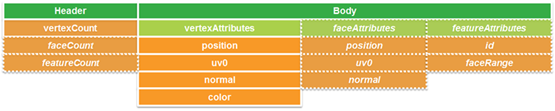
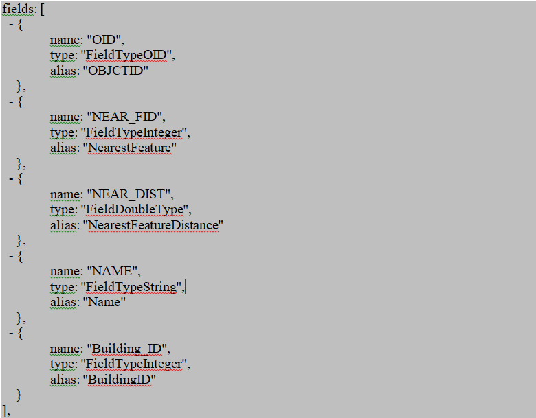
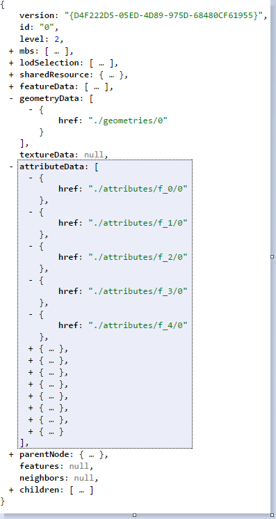
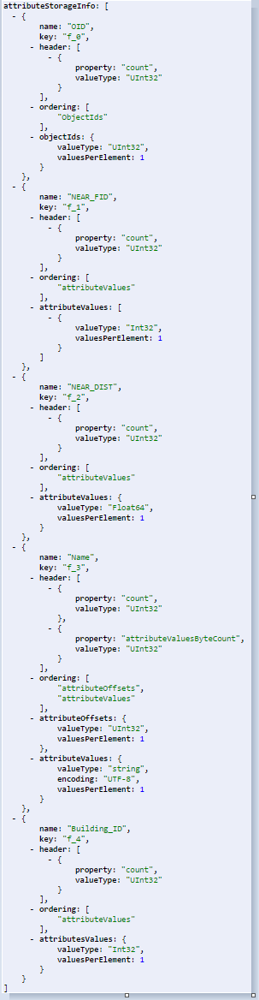

== I3S File Formats

=== 8.1	Textures

The Textures file is a binary resource that contains one or multiple images that are used as textures of features in the store. 
A single Texture.bin file contains 1...n textures for a single specific texture LoD. It can contain a single texture atlas or 
multiple individual textures.  The bundling strategy is determined by the authoring application so that specific aspects of the 
materials and textures used can be taken into account, such as tiling.

==== 8.1.1	Texture Recommendations and Requirements
The number and volume of textures tends to be the limiting display factor, especially for web and mobile clients. Thus, this 
standard provides several recommendations and requirements on texture resources that are delivered as part of an Indexed 3D Scene.

==== 8.1.2	Image Formats
I3S supports multiple texture formats. The choice of format depends on the use case. For example, a client application might 
prefer consuming the more compact JPEG (and/or PNG) formats over low bandwidth conditions since they are very efficient to 
transmit and have a widespread adoption. However, client applications that might be constrained for memory or computing resource 
might prefer to directly consume compressed textures such as S3TC for scalability and performance reasons. 

As a result, the I3S standard supports most commonly used image formats such as JPEG/PNG as well as rendering optimized 
compressed texture formats such as S3TC. The only requirement is the authoring application needs to provide the appropriate 
`textureEncoding` declaration by using MIME types such as, “image/jpeg” (for Jpeg) and “image/vnd-ms.dds” (for S3TC).  

==== 8.1.3	Texture Sets
This standard allows the combination of multiple textures into a single resource by using array buffer views. However, we 
generally recommend using large atlases (e.g. 2048x2048px) and then to use exactly one texture per bundle.

==== 8.1.4	Atlas usage and Regions
Individual textures should be aggregated into texture atlases. Each individual texture becomes a subtexture. As with all texture 
resources, the atlas has to be 2n-sized on both dimensions, with n being in the range [3,12]. Width and height dimensions do not 
have to be equal, e.g. 512px x 256px. Subtextures contained within an atlas also need to be 2n-sized, with n being in the 
range [3,12]. Otherwise if their width or height dimension is not 2n, border artifacts are likely to appear when filtering or 
MIP-mapping. If source subtexture dimensions do not match this requirement, they need to be padded (with nearest/interpolated 
pixels) or scaled to the nearest lower 2n size. An image that is 140px x 90px would thus be rescaled to 128px x 64px before 
being inserted into the atlas or padded to 256px x 128px.

Subtexture pixels are identified by the `subimageRegion`: [`umin`, `vmin`, `umax`, `vmax`] attribute. Region information is 
passed on to the shader using a separate vertex attribute so that every vertex UV coordinate becomes a UVR coordinate, with 
the R encoding the [`umin`, `vmin`, `umax`, `vmax`] of the region in 4 UInt16 values. 

==== 8.1.5	Texture coordinates
Client capabilities for handling complex UV cases vary widely, so texture coordinates are used. Texture coordinates do not 
directly take atlas regions into account. They always range from 0...1 in U and V, except when using the "repeat" 
wrapping mode, where they may range from 0...n (n being the number of repeats). The client is expected to use the 
`subimageRegion` values and the texture coordinates to best handle repeating textures in atlases. This approach has been 
selected since client capabilities in dealing with more complex UV cases vary greatly.

==== 8.1.6	Generating Image IDs
The Id of an image is generated using the following method:

```
UInt64 BuildID(LONG id, int w, int h , int l, int al)
{
    UInt64 l_al = ((UInt64)al)<<60;
    UInt64 l_l = ((UInt64)l)<<56;
    UInt64 l_w = ((UInt64)(w - 1))<<44;
    UInt64 l_h = ((UInt64)(h - 1))<<32;
    UInt64 id64 = l_al + l_l + l_w + l_h + (UInt64)id;
    return id64;
}
Usage syntax: 
UInt64 image_id = BuildID(id, w, h, l, al); 
```
===== 8.1.6.1	Function Parameters

|===
|id	|Index of the texture in the store, start from 1
|w	|Width of the texture
|h	|Height of the texture
|l	|Index of the level that the texture belong to, start from 0
|al	|Level count of the texture
|===

=== 8.2	Geometry
The binary geometry attribute file follows the Khronos http://www.khronos.org/registry/typedarray/specs/latest/[Typed Array specification] in the https://www.ecma-international.org/publications/standards/Ecma-262.htm[ECMAScript® 2015 Language Specification]. Citing the overview of that specification:

“This specification defines an ArrayBuffer type, representing a generic fixed-length binary buffer. The contents of an ArrayBuffer cannot be directly manipulated. Instead, a group of types are used to create views of the ArrayBuffer. For example, to access the buffer as an array of 32-bit signed integers, an Int32Array would be created that refers to the ArrayBuffer.
Multiple typed array views can refer to the same ArrayBuffer, of different types, lengths, and offsets. This allows for complex data structures to be built up in the ArrayBuffer. As an example, given the following code:

```
// create an 8-byte ArrayBuffer
var b = new ArrayBuffer(8);

// create a view v1 referring to b, of type Int32, starting at
// the default byte index (0) and extending until the end of the buffer
var v1 = new Int32Array(b);

// create a view v2 referring to b, of type Uint8, starting at
// byte index 2 and extending until the end of the buffer
var v2 = new Uint8Array(b, 2);

// create a view v3 referring to b, of type Int16, starting at
// byte index 2 and having a length of 2
var v3 = new Int16Array(b, 2, 2);
```

This defines an 8-byte buffer b, and three views of that buffer, v1, v2, and v3. Each of the views refers to the same buffer -- so v1[0] refers to bytes 0..3 as a signed 32-bit integer, v2[0] refers to byte 2 as a unsigned 8-bit integer, and v3[0] refers to bytes 2..3 as a signed 16-bit integer. Any modification to one view is immediately visible in the other: for example, after v2[0] = 0xff; v2[1] = 0xff; then v3[0] == -1 (where -1 is represented as 0xffff)."

[#fig_geometrybuffer,reftext='{figure-caption} {counter:figure-num}']
.Geometry Buffer Layout with headers


Note: The expected triangle/face winding order in all geometry resources is counterclockwise (CCW).

Note: If normal vectors are present in a geometry, they need to be calculated based on uniform axis units. They are always given as if x, y and z axes all had metric units, as a unit vector. This means that if WGS84 is used as a horizontal CRS, the normal calculation cannot directly use the face's WGS84 coordinates, but needs to convert them to a local Cartesian CRS first.

=== 8.3	Attribute Data

Attribute data is stored within I3S layers as part of the Scene Service cache along with geometry, texture, and material resources in an optimized, render friendly format.

By attribute data we mean the tabular information stored as an attribute of a feature class, which is the primary input source of scene services.

Attribute data for all features in a node is stored and made available as discrete, per field resource called *_attribute_*. The number of attribute resources corresponds to the number of fields the service publisher opted to include in the scene cache. 

A key concept of this storage model is that the order in which attribute values are stored within any _attribute_ resource SHALL be the same as the order in which the feature geometries are stored within the geometry resource of that node. This allows clients who fetch these resources to render each node efficiently - using direct array access to retrieve feature attribute(s) without the need for object-id based attribute lookups.

For cases where object-id based access to attributes is needed, the _attribute_ resource representing the object-id field stores the _object-id_ values of each feature within the node and SHALL use the same storage order as the geometry resource. This facilitates object-id based access. Clients can also build an object-id to array-index dictionary for cases where large numbers of object-id based attribute or geometry look ups within a node are needed. (Note: the following ways of referring to the ObjectId of a feature are equivalent in these and previous versions of the I3S specification: ObjectId, object-id, OID, FID). 

When the same feature is included in multiple nodes at different levels of detail, the corresponding attributes for the feature are also included as _attribute_ resource/s of each node it is present in. This redundancy in attribute storage allows each node to be rendered independently of any other node.

Metadata on each _attribute_ resource is made available to clients via the `scene service layer`. When attributes are present within the scene cache, the resourcePattern array in the layers store (layers[id].store.resourcePattern) will include a value called Attributes, indicating attributes are a required resource, utilized for attribute driven symbolization and rendering. In addition to the resourcePattern, additional metadata in the fields array and attributeStorageInfo array further describe each attribute resource.

These metadata allow clients to initialize and allocate any required client side resources prior to accessing any attributes of interest.

[#fig_fields,reftext='{figure-caption} {counter:figure-num}']
.Example of the fields array resource


_Detail: The above is an example of the fields array (layers[id].fields[id]) resource of a scene service layer illustrating different supported types of feature attribute fields. The fields array describes an attribute field with respect to its name, type and alias._

==== 8.3.1	The content of this binary attribute resource is made up of:

Clients can use the key property (layers[id].attributeStorageInfo[].key) of the attributeStorageInfo to uniquely identify and request the *attribute* resource through a RESTful API, called attributes. Clients use the _attributeStorageInfo_ metadata to decode the retrieved attribute binary content.

The attribute resource header contains:

* A header section of 4 bytes which indicates the count of features. The count value SHALL be present in all _attribute_ resources. For an _attribute_ resource of a string data type, the header has an additional 4 bytes indicating the total byte count of the string attribute values.
* For all numerical field types, the header section SHALL be followed by the attribute values array record. The attribute values SHALL always begin at an offset that is divisible by the byte length of a single value. If the header does not end at such an offset, the necessary amount of padding SHALL be inserted between the header and the attribute values.
* For string field types, the header section SHALL be followed by a fixed length array whose values are the byte counts of each string data, inclusive of the null termination character. This array SHALL then followed by an array of actual string data. The strings SHALL be stored null terminated.

_An example JSON encoding for a 3dSceneLayer mesh pyramid can be found at code 1. This is a scene layer resource illustrating the metadata information found in the fields (layers[id].fields[id]) and attributeStorageInfo arrays (layers[id].attributeStorageInfo[id])._

A client application will be able to find the URI of any attribute resource through its href reference from the *attributeData* array of the *Node Index Document* (similar access patterns exist for resources such as 'features', 'geometries', etc …). See Figure 12 below:

[#fig_node_resource,reftext='{figure-caption} {counter:figure-num}']
.A node resource document


_Detail: A node resource document illustrating attribute data content access URLs (href)._

==== 8.3.2 REST API for Accessing Attribute Resources directly from a scene service layer

The _attributes_ REST API allows client apps to fetch the attribute records of a field using its _key_ property directly from a scene service layer. As a result, every scene node (with the exception of 'root' node), exposes available attribute fields as discrete _attribute_ resources. These resources are accessible thru a relative URL to any Node Index Document.

The attributes REST API syntax: URL: *http://<sceneservrice-url>/attributes/<field_key>/<id>*
* _attributes_: the RESTful resource responsible for fetching the binary attribute resource. A client application will be able to decode the content of this attribute resource based on the metadata information found in the scene layer 
* _attributeStorageInfo_ array (which adequately describes the content of the binary data).
* _field_key_: the key value used to request the desired feature attribute content.
* _Id_: the bundle id of the attribute binary resource, corresponding to the geometry bundle id. By default this value is 0 (same as the geometry bundle id). If a node has more than 1 geometry resource, then the id of the _attribute_ resource SHALL match the geometry bundle id.

==== 8.3.3	A typical usage pattern of the attributes REST API

- A client should get the attribute field from the metadata by fetching the scene server layers REST resource prior to symbolizing the node base on attribute information. The _layers_ resource contain the fields (layers[Id].Fields[id]) array, which lists all available attribute fields and types and the _attributeStorageInfo_ (layers[id].attributeStorageInfo[id]) array, which describes the content of each binary _attribute_ resource.

* The _fields_ array object contains a collection of objects that describe each attribute field regarding its field name ('name'), datatype ('type') and a user friendly name ('alias'). The fields array includes all fields that are present in the source feature layer of the scene service layer. 
* The _attributeStorageInfo_ array contains a collection of objects that describes all _attribute_ binary resources. It includes only fields the publisher/author chose to include as part of the scene cache during publishing time. The _attributeStorageInfo_ contains metadata information about the binary _attribute_ resources. The _attributeStorageInfo_ properties are defined in clause <insert reference>. 

Note that the _key_ property (with values such as f_0, f_1, etc...) is automatically computed and that there shouldn't be any relationship assumed to the field index of the source feature class (especially important when a user adds or deletes fields during the lifetime of a layer). 

[#fig_scene_resource,reftext='{figure-caption} {counter:figure-num}']
.An expanded view of a scene layer resource


_More detail: The above is an expanded view of a scene layer resource showing the content of an attributeStorageInfo resource. The example shows 5 objects each corresponding to the 5 objects of the fields resource (as matched by the 'key' and 'name' properties present in both arrays).The JSON representation of the example is located in 3D Scene Layer examples section._

- A client application equipped with the list of available fields and the corresponding attribute-value-array metadata can then fetch the attribute values of interest just by supplying the desired field key as part of the *attributes* REST request. Furthermore, the client will also be capable of decoding the fetched _attribute_ resource based on the metadata as retrieved in step 1.

Note: The geometry buffer contains the _objectIDs_ array as the last section of the geometry layout (layers[id].store.defaultGeometrySchema.featureAttributes). A client application that has a need to access the _ObjectIDs_ array, should first check in the geometry buffer before requesting it from the *attributes* REST resource. 

The following example below shows the attributes REST request signature:

* http://<myserver>/<my product>/rest/services/Hosted/SanFran/SceneServer/layers/0/nodes/0-0-0-0/attributes/0/f_1
* http://<myserver>/<my product>/rest/services/Hosted/SanFran/SceneServer/layers/0/nodes/0-0-0-/attributes/0/f_2 

In the first example above we are requesting the attributes of all features for a _field_ named 'NEAR_FID', as identified by its field key (f_1) in Figure 11. This field resource contains the attribute values of all _features_ that are present in node 0-0-0-0. Similarly, the second example will fetch the attributes of all features associated with the field called ('NEAR_DIST') using its key (f_2).

