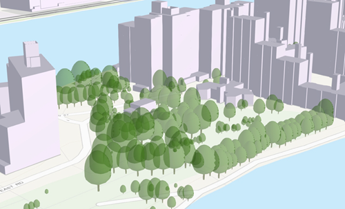
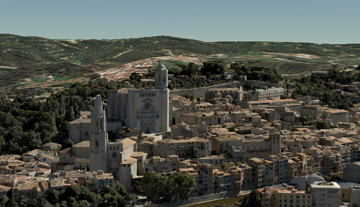
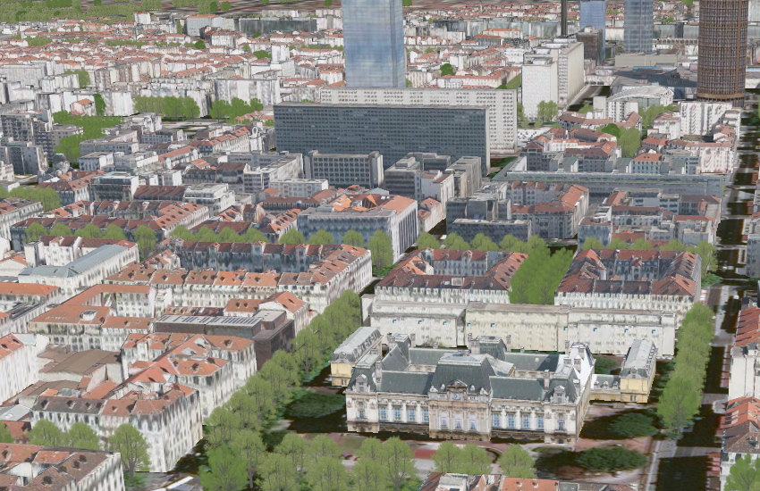
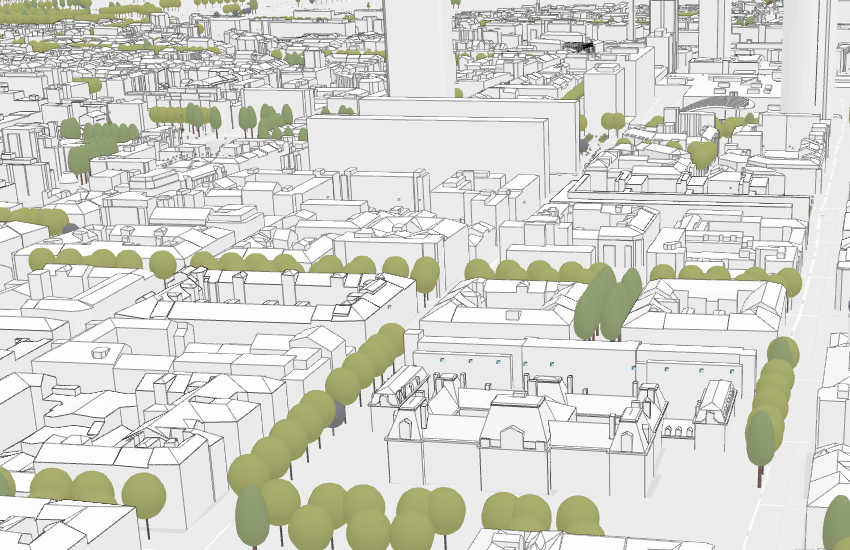

== Supported I3S Layer Structures
This section provides detailed information on the supported I3S layer structures for:

-	Point Scene Layers
-	Integrated Scene Mesh Layer
-	3D Object Scene Layer

Profiles of the mandatory classes that define the layer are provided in a corresponding annex.

=== Point Scene Layer
Point scene layers contain point features and their attributes. Point scene layers are often used to visualize large amounts of 3D data like trees or buildings. Most phenomena that can be visualized by 3D symbols can be displayed with a point scene layers.

[#fig_pointscenelayer,reftext='{figure-caption} {counter:figure-num}']
.Example of a point scene layer


====	Point Scene Layer Structure
Point scene layers contain point features and their attributes. Point scene layers are often used to visualize large amounts of 3D data like trees or buildings. Most phenomena that can be visualized by 3D symbols can be displayed with a point scene layers.
The point scene layer is structured into a tree of multiple JSON files. Besides storing information in the JSON format, some are also provided as binary buffer. Point scene layers can be used to create a scene layer package (*.slpk) or an I3S service. A point scene layer _SHALL_ contain profiles of the following classes:

-	Layer description
-	Nodes containing Geometry and Attributes
-	Node Index Document
-	Statistics

Please visit Annex G for details on the Point Scene Layer Profile as well as a full JSON example.

====	Example of point scene layer structure

```
.<host>/SceneServer/layers
	+--0 // scene layer document
	+-- nodes
	|  +--root
	|  |  +-- attributes
	|  |  |  +--f_2
	|  |  |  +--f_4
	|  |  |  +--(...)
	|  |  +-- features
	|  |  |  +-- 0
	|  +-- (...)
	+--statistics
	|  +-- f_2
	|  | +--0
	|  +-- f_4
	|  | +--0
	|  +-- (...)
	+--resources
	    +-- styles
	 	| +-- root
	 	| +-- web 
```

====	HTTP API Overview
The following API methods are available for the I3S Point Scene Layer:

The following API methods are available for the I3S Point Scene Layer:

[width="90%",options="header"]
|===
|*Resource* |*Type* |*Description* |*URL Template*
|Scene Layer Document |`JSON` |This is the root document for the service that will contain properties common to the entire layer. |`http://serviceURL/layers/{layerID}`
|===

- `layerID`: Integer. ID of the associated layer.

Example: http://my.server.com/PointSceneLayer/SceneServer/layers/0

[width="90%",options="header"]
|===
|*Resource* |*Type* |*Description* |*URL Template*
|Node Document	|`JSON`	|Description of the node.	|`http://serviceURL/layers/{layerID}/nodes/{resourceID}`
|===

- `layerID`: Integer. ID of the associated layer. 
- `resourceID`: String. ID of the associated resource.

Example: http://my.server.com/PointSceneLayer/SceneServer/layers/0/nodes/98

[width="90%",options="header"]
|===
|*Resource* |*Type* |*Description* |*URL Template*
|Statistics	|`JSON`	|The statistics for the entire layer for a specific attribute.	|`http://serviceURL/layers/{layerID}/statistics/f_{attributeID}/0`
|===

- `layerID`: Integer. ID of the associated layer. 
- `attributeID`: Integer. ID of the specific attribute for the layer.

Example: http://my.server.com/PointSceneLayer/SceneServer/layers/0/statistics/f_48/0

[width="90%",options="header"]
|===
|*Resource* |*Type* |*Description* |*URL Template*
|Attributes	|`JSON`	|The attributes for the entire layer for a specific attribute.	|`http://serviceURL/layers/{layerID}/attributes/f_{attributeID}/0`
|===

- `layerID`: Integer. ID of the associated layer.
- `attributeID`: Integer. ID of the specific attribute for the layer.

Example: http://my.server.com/PointSceneLayer/SceneServer/layers/0/attributes/f_48/0

[width="90%",options="header"]
|===
|*Resource* |*Type* |*Description* |*URL Template*
|Feature |`JSON` |Point location and feature IDs. |`http://serviceURL/layers/{layerID}/nodes/{resourceID}/features/0`
|===

- `layerID`: Integer. ID of the associated layer. 
- `resourceID`: String. ID of the associated node.

Example: http://my.server.com/PointSceneLayer/SceneServer/layers/0/nodes/98/features/0

=== Integrated Mesh Scene Layer

Integrated mesh scene layers are generally created for citywide 3D mapping. Integrated mesh scene layers include an entire surface and cannot be restyled. Three-dimensional mesh data are typically captured by an automated process (e.g. drone) for constructing 3D objects out of large sets of overlapping imagery. The result integrates the original input image information as a textured mesh including 3D objects, such as buildings and trees, and elevation information.

[#fig_integratedmeshlayer,reftext='{figure-caption} {counter:figure-num}']
.Example of an integrated mesh scene layer


==== 9.2.1	Integrated Mesh Scene Layer Structure
The Integrated Mesh scene layer is structured into a tree of multiple JSON files. Besides storing information in the JSON format, some are also provided as binary buffer. Integrated mesh scene layers can be used to create a scene layer package (*.slpk) or an I3S service. An Integrated Mesh scene layer _SHALL_ contain profiles of the following classes:

- Layer description (See Class 3DSceneLayerInfo Common Profile)
- Nodes containing Geometry, Feature Data, and Texture
- Shared Resources

Please visit Annex H for more details on the Integrated Mesh Layer Profile as well as a JSON example.

.<host>/SceneServer/layers
	+--0 // scene layer document
	+-- nodes
	|  +--0
	|  |  +-- geometries
	|  |  |  +-- 0
	|  |  |  +-- 1
	|  |  |  +--(...)
	|  |  +-- textures
	|  |  |  +-- 0
	|  |  |  +-- 1
	|  |  |  +--(...)
	|  |  +-- shared 
    |  +-- (...)

==== 9.2.3 Integrated Mesh Scene Layer HTTP API Overview

The following API methods are available for Integrated Mesh Scene Layer:

[width="90%",options="header"]
|===
|*Resource* |*Type* |*Description* |*URL Template*
|Scene Layer Document 	|`JSON`  |This is the root document for the service that will contain properties common to the entire layer. 	|`http://serviceURL/layers/{layerID}`
|===

- `layerID`: Integer. ID of the associated layer. 

Example: http://my.server.com/IntegratedMeshSceneLayer/SceneServer/layers/0

[width="90%",options="header"]
|===
|*Resource* |*Type* |*Description* |*URL Template*
|Node Document 	|`JSON`  |Description of the node.  |`http://serviceURL/layers/{layerID}/nodes/{resourceID}`
|===

- `layerID`: Integer. ID of the associated layer. 
- `resourceID`: String. ID of the associated resource.

Example: http://my.server.com/IntegratedMeshSceneLayer/SceneServer/layers/0/nodes/98

[width="90%",options="header"]
|===
|*Resource* |*Type* |*Description* |*URL Template*
|Textures  |`JPG`, `PNG`, `DDS`, `KTX` 	|The texture resource (image)  |`http://serviceURL/layers/{layerID}/nodes/{resourceID}/textures/{texture ID}`
|===

- `layerID`: Integer. ID of the associated layer. 
- `resourceID`: String. ID of the associated node.
- `textureID`: String. This ID returns one of the textures available for this node. The same texture may be available in different formats.

Example: http://my.server.com/IntegratedMeshSceneLayer/SceneServer/layers/0/nodes/98/textures/1

[width="90%",options="header"]
|===
|*Resource* |*Type* |*Description* |*URL Template*
|Geometries 	|`bin` 	|The geometry resource (mesh information)  |`http://serviceURL/layers/{layerID}/nodes/{resourceID}/geometries/0`
|===

- `layerID`: Integer. ID of the associated layer.
- `resourceID`: String. ID of the associated node.

Example: http://my.server.com/IntegratedMeshSceneLayer/SceneServer/layers/0/nodes/98/geometries/0

[width="90%",options="header"]
|===
|*Resource* |*Type* |*Description* |*URL Template*
|Shared Resources  |`JSON`  |Texture and material descriptions.  |`http://serviceURL/layers/{layerID}/nodes/{resourceID}/shared`
|===

   - `layerID`: Integer. ID of the associated layer.
   - `resourceID`: String. ID of the associated node.

Example: http://my.server.com/IntegratedMeshSceneLayer/SceneServer/layers/0/nodes/98/shared

=== 3D Object Scene Layer
A 3D object scene layer is used to visualize 3D objects. 3D object scene layers are often created from GIS data with attributes and explicitly modeled in 3D. These attributes allow definition queries to specify symbology and other properties in lieu of setting properties for each object individually. A 3D object scene layer can efficiently create and share just a few buildings or an entire city.

[#fig_3dobjectlayer1,reftext='{figure-caption} {counter:figure-num}']
.Example of a Realistic 3D Object Scene Layer with textures


[#fig_3dobjectlayer1,reftext='{figure-caption} {counter:figure-num}']
.Example of a Thematic 3D Object Scene Layer without textures


====9.3.1	3D Object Scene Layer Structure
The 3D object scene layer is structured into a tree of multiple JSON files. Besides storing information in the JSON format, some are also provided as binary buffer. A 3D object scene layer can be used to create a scene layer package (*.slpk) or an I3S service. A 3D object scene layer contains the following:

- Layer description(3DSceneLayerInfo)
- Nodes containing Geometry (geometry) and Attributes (attributeStorageInfo)
- Node Index Document (3DNodeIndexDocument)
- Statistics (statsInfo)

==== 9.3.2	Example of 3D Object layer structure

.<host>/SceneServer/layers
	+--0 // scene layer document
	+-- nodes
	|  +--0
	|  |  +-- attributes
	|  |  |  +--f_2
	|  |  |  +--f_4
	|  |  |  +--(...)
	|  |  +-- geometries
	|  |  |  +-- 0
	|  |  +-- textures
	|  |  |  +-- 0
	|  |  |  +-- 0_0_1
	|  |  |  +--(...)
	|  |  +-- shared 
	|  |  (...) 
	+--statistics
	|  +-- f_2
	|  |  | +--0
	|  +-- f_4
	|  |  | +--0
	|  +-- (...)

====9.3.3	3D Object HTTP API Overview
The following API methods are available for the 3D Objects scene layer:

[width="90%",options="header"]
|===
|*Resource* |*Type* |*Description* |*URL Template*
|Scene Layer Document| 	`JSON` 	|This is the root document for the service that will contain properties common to the entire layer.  |`http://serviceURL/layers/{layerID}`
|===

- `layerID`: Integer. ID of the associated layer. Esri products expect this to be 0.

Example: http://my.server.com/3DObjectSceneLayer/SceneServer/layers/0

[width="90%",options="header"]
|===
|*Resource* |*Type* |*Description* |*URL Template*
|Node Document 	|`JSON`  |Description of the node.  |`http://serviceURL/layers/{layerID}/nodes/{resourceID}`
|===

- `layerID`: Integer. ID of the associated layer. Esri products expect this to be 0.
- `resourceID`: String. ID of the associated resource.

Example: http://my.server.com/3DObjectSceneLayer/SceneServer/layers/0/nodes/98

[width="90%",options="header"]
|===
|*Resource* |*Type* |*Description* |*URL Template*
|Textures  |`JPG`, `PNG`, `DDS`, `KTX` 	|The texture resource (image) 	|`http://serviceURL/layers/{layerID}/nodes/{resourceID}/textures/{texture ID}`
|===

- `layerID`: Integer. ID of the associated layer. Esri products expect this to be 0.
- `resourceID`: String. ID of the associated node.
- `textureID`: String. This ID returns one of the textures available for this node. The same texture may be available in different formats.

Example: http://my.server.com/3DObjectSceneLayer/SceneServer/layers/0/nodes/98/textures/1

[width="90%",options="header"]
|===
|*Resource* |*Type* |*Description* |*URL Template*
|Geometries | `bin `	|The geometry resource. |`http://serviceURL/layers/{layerID}/nodes/{resourceID}/geometries/0`
|===

- `layerID`: Integer. ID of the associated layer. Esri products expect this to be 0.
- `resourceID`: String. ID of the associated node.

Example: http://my.server.com/3DObjectSceneLayer/SceneServer/layers/0/nodes/98/geometries/1

[width="90%",options="header"]
|===
|*Resource* |*Type* |*Description* |*URL Template*
|Statistics |`JSON` 	|The statistics for the entire layer for a specific attribute. 	|`http://serviceURL/layers/{layerID}/statistics/f_{attributeID}/0`
|===

- `layerID`: Integer. ID of the associated layer. Esri clients expect this to be 0.
- `attributeID`: Integer. ID of the specific attribute for the layer.

Example: http://my.server.com/3DObjectSceneLayer/SceneServer/layers/0/statistics/f_48/0

[width="90%",options="header"]
|===
|*Resource* |*Type* |*Description* |*URL Template*
|Attributes |`JSON`  |The attributes for the entire layer for a specific attribute. 	|`http://serviceURL/layers/{layerID}/attributes/f_{attributeID}/0`
|===

- `layerID`: Integer. ID of the associated layer. Esri products expect this to be 0.
- `attributeID`: Integer. ID of the specific attribute for the layer.

Example: http://my.server.com/3DObjectSceneLayer/SceneServer/layers/0/attributes/f_48/0

[width="90%",options="header"]
|===
|*Resource* |*Type* |*Description* |*URL Template*
|Shared Resources  |`JSON` |Texture and material descriptions. 	|`http://serviceURL/layers/{layerID}/nodes/{resourceID}/shared`

- `layerID`: Integer. ID of the associated layer. Esri products expect this to be 0.
- `resourceID`: String. ID of the associated node.

Example: http://my.server.com/3DObjectSceneLayer/SceneServer/layers/0/nodes/98/shared
