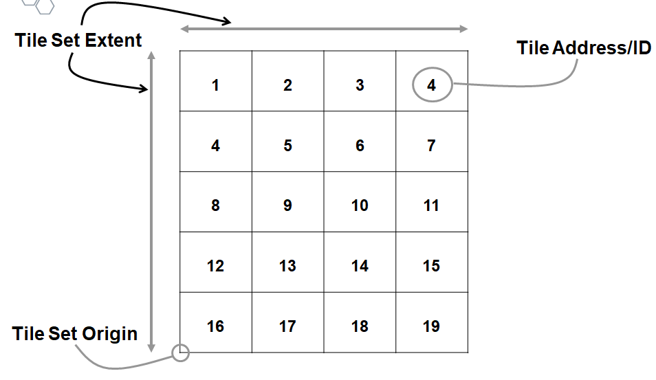
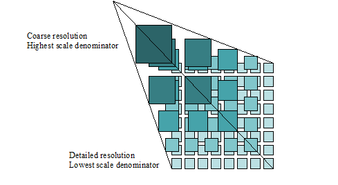

== Introduction

For many geospatial technology applications and use cases, there is the need (requirement!) to partition the space of interest. Examples are numerous. Within the OGC standards baseline, CDB defines how to partition the globe into a set of 2d tiles for many levels of detail. The Web Matrix Tile Set (WMTS) standard defines the rules and requirements for a tile matrix set as a way to index space based on a set of regular grids defining a domain (tile matrix) (tile matrix) for a limited list of scales in restricted set of Coordinate Reference Systems (CRS). The new - and more general - Tile Matrix Set standard specifies the concept of a tile matrix set and tile matrix set limits and its implementation in 2D space. Finally, the OGC I3S Community Standard defines how to partition 3d space using a hierarchical, node-based spatial index structure in which each node’s payload may contain features with associated geometry, textures and attributes.

In geometry, space partitioning is the process of dividing a space (usually a Euclidean space) into two or more disjoint subsets. In other words, space partitioning divides a space into non-overlapping regions. Any point in the space can then be identified to lie in exactly one of the regions. 

Within that context, the requirements for partitioning space based on dimension can be considered. This OGC Abstract Specification presents a conceptual model for partitioning (tiling) 2-D Euclidean space. Tiling of 2d Euclidian space is the most commonly known approach to partitioning space. However, there are common mandatory elements for any approach to partitioning space in any dimension. This document defines the several common required elements that apply to any dimension and then follows with more specific requirements for the 2-D tiles and tiling case.

Please note that in the preparation of this conceptual model, the tiling sections/extensions to CDB, GeoPackage, WMTS, and MVT were reviewed. The OGC DGGS standard and various Engineering Reports from the OGC Test Bed 13, Test Bed 14 and the Vector Tiles Pilot were also considered. Finally, the new Tile Matrix Set candidate standard was reviewed. Much of this document is derived by abstracting what is contained in those existing and candidate standards and specifications.

The goal is to define a simple conceptual model that can support any and all requirements for tiled data stores and applications including extensions for visualization, portrayal, analytics, filtering, lelvels of detail, and so forth. These various use cases and/or workflows are not part of the core conceptual model but instead may be thought of as profiles or extensions of the model that restrict core requirements or define additional requirements. For example, the majority of the CDB standard that deals with tiles defines additional requirements such as level of detail to optimize the data store for that domain of interest.

=== Key concept - The assumption of a 2-D planar space

The tiling conceptual model defined in this document assumes that the tiling target is a two dimensional plane in Euclidean space. However, the content to be stored in a tiled structure is typically earth (or planetary body) referenced. Therefore, the transformation from a spheroidal coordinate system into a planar system is required. The following paragraph, extracted from the Tile Matrix Set Standard, describes the solution for coordinate reference systems other than geographic (Latitude, Longitude).

_As stated in OGC 08-015r6 Abstract Specification Topic 2: Spatial referencing by coordinates, a coordinate system is a set of mathematical rules for specifying how coordinates are to be assigned to points in space. A Coordinate Reference System (CRS) is a coordinate system that is related to the real world by a reference datum. An example of mathematical rules is the application of a sphere or an ellipsoid centered in the datum and the use of a projection to transform the sphere or the ellipsoid into a planar representation of the world._

The remainder of this abstract specification assumes that the space to be tiled is a two dimensional planar surface in Euclidean space.

=== Two key use cases

There are two distinct but related use cases for implementing and using a tiled structure: storage and visualization. In both cases, the driving force is the desire to enhance performance. Performance could be in terms of access latency, caching, and/or streaming of relevant content to a client.

==== Storage Use Case

In this use case, geospatial content is subdivided into small units called tiles. The intent is to significantly enhance such operations as search, update, and presentation of the source content in its "native" form. In this use case, the original geospatial data (raster, grid, vector, point clouds, etc) is maintained. There is no special processing to create forms of the data specifically for high speed caching and rendering on the client. This is the Visualization use case and is described in the next clause.

A very typical storage use case would be a city defining the tile structure for its spatial data store. They could begin by defining the geographic extent of the entire area of interest and could include a fringe area for future growth. Typically, in the US cities work in State Plane coordinates, such as Colorado North zone (NAD 83) for the City of Ft. Collins. The parameters are available in the EPSG database (EPSG 2876). The units of measure are feet. They pick a tile set origin that is the same for all tile sets in the data store. Typically, GIS practitioners think of origins being in the lower left corner so that option is selected for both the tile set and for each tile in a tile set. They then choose a regular square tessellation. They wish to create three tile sets with unique IDs of Parcels, Streams, and Roads. Each tile set will have a different tile size. Parcels will have a tile width and height of 1000 feet. Streams will have a tile width and height of 5000 feet. Roads will have a tile width and height of 2000 feet.

[#img_Storage,reftext='{figure-caption} {counter:figure-num}']
.Example tile set for above parcel map use case

==== Visualization Use Case

The Visualization use case is focused on providing high speed geospatial content rendering and visualization capabilities on a client. In this use case, the source geospatial data is heavily processed and restructured and reformatted to be optimized for visualization on one or more clients. For example, source vector data that is topologically structured and semantically rich may be processed into a tile matrix of PNG images and all geometry, topology, and semantics are lost. 

[#img_tilematrix,reftext='{figure-caption} {counter:figure-num}']
.Example tile matrix for visualization

=== Characteristics of a Conceptual Model

The terms and definitions clause in this Abstract Specification provides a short definition for "conceptual Model". This clause provides additional information on the OGC use of "conceptual model".

A conceptual model is a representation of a system, made of the composition of concepts which are used to help people know, understand, or simulate a subject the model represents. A documented conceptual model represents 'concepts' (entities), the relationships between them, and a vocabulary.

A conceptual model organizes the vocabulary needed to communicate consistently and thoroughly about the know-how of a problem domain. The aim of a conceptual model is to express the meaning of terms and concepts used by domain experts to discuss the problem, and to find the correct relationships between different concepts. A conceptual model:

* is a representation of a system, made of the composition of concepts which are used to help people know, understand, or simulate a subject the model represents. A documented conceptual model represents 'concepts' (entities), the relationships between them, and a vocabulary.

* is explicitly defined to be independent of design or implementation concerns. The aim of a conceptual model is to express the meaning of terms and concepts used by domain experts to discuss the problem, and to find the correct relationships between different concepts.

* organizes the vocabulary needed to communicate consistently and thoroughly about the know-how of a problem domain.

* starts with a glossary of terms and definitions.  There is a very high premium on high-quality, design-independent definitions, free of data or implementation biases.  The model also emphasizes rich vocabulary.

* is always about identifying the correct choice of terms to use in communications, including statements of rules and requirements, especially where high precision and subtle distinctions need to be made.  The core concepts of a geospatial problem domain are typically quite stable over time.

==== Conceptual Model vs. Logical (Data) Model footnoteref:[note2,A good discussion of the relationship between concptual and logical in data modeling is here: http://uksanjay.blogspot.com/2012/06/difference-between-conceptual-logical.html.]

A conceptual model differs from a logical model in important ways.  The goal of a conceptual model is to support the expression of natural-language statements, and supply their semantics — not unify, codify (and sometimes simplify) data.  Therefore the vocabulary included in a conceptual model is far richer, as suits knowledge-intensive problem domains.  In short, conceptual models are concept-centric; logical models are thing-entity-or-class-centric.

Logical models can usually be rather easily derived from conceptual models; the reverse is much harder (or impossible).  Like logical models, conceptual models are often rendered graphically, but free of such distractions to stakeholders as cardinalities.
